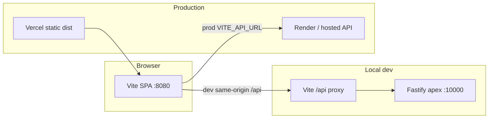

# Apex Frontend — Agent Guide

Apex is a **sim racing web app** (sessions, leaderboards, challenges, community, admin). This package is a **Vite + React SPA** that talks to the **Fastify API** in the sibling `apex` backend repo—not an embedded Express server.

## Tech stack

| Layer | Choice |
|-------|--------|
| Runtime | React 18, TypeScript |
| Routing | React Router 7 (SPA, `BrowserRouter`) |
| Build | Vite 7 |
| Styling | Tailwind CSS 3, CSS variables in `src/global.css` |
| UI primitives | Radix UI + shadcn-style components in `src/components/ui/` |
| Data fetching | TanStack Query v5 |
| Forms / validation | react-hook-form + Zod 4 |
| Icons | lucide-react |
| Toasts | sonner |
| Tests | Vitest (`src/**/*.test.ts`, `src/**/*.spec.ts`) |
| Package manager | **pnpm** (see `packageManager` in `package.json`) |

## Repository layout

```
apex-frontend/
├── index.html              # Vite entry; script → /src/main.tsx
├── vite.config.ts          # Dev server :8080, /api proxy, @ → src
├── vercel.json             # SPA rewrites + no-store on index
├── tailwind.config.ts
├── tsconfig.json           # paths: "@/*" → "./src/*"
├── vitest.config.ts
├── public/                 # Static assets (logo, sitemap, sim SVGs)
├── src/
│   ├── main.tsx            # Mount + global.css
│   ├── App.tsx             # Routes, providers, layout shell
│   ├── global.css          # Theme tokens (--background, --primary, …)
│   ├── pages/              # Route-level screens (+ pages/admin/)
│   ├── components/         # Shared UI (Header, ActivityCard, profile/, ui/)
│   ├── features/           # Cross-page feature modules (settings, session-detail, manual-activity)
│   ├── lib/                # Utilities, API client, validation, grouping logic
│   ├── auth/               # Route guards (ProtectedRoute, AdminRoute, GuestOnlyRoute)
│   ├── contexts/           # AuthContext (GET /api/auth/me)
│   └── config/             # navigation.ts — header/footer link source of truth
└── .builder/rules/         # Cursor/Builder agent rules (*.mdc)
```

There is **no** `client/`, `server/`, or `shared/` folder in this repo anymore.

## Architecture



- **All business logic and persistence** live in the **apex backend** (`/api/*`).
- The frontend only renders UI, calls APIs, and stores the JWT in `localStorage` (`apex_token`).
- **Do not** add Express routes or a local BFF in this repo unless the product explicitly requires it.

### API client (`src/lib/api/`)

- **`config.ts`** — `API_BASE` from `VITE_API_URL` / `VITE_APEX_API_BASE_URL`, or defaults (`http://127.0.0.1:10000` dev, Render URL in prod builds).
- **`fetchClient.ts`** — `fetchApi()`, auth headers (`apex_token`, device id, server session cookie key), 401 → `registerAuthExpiredHandler`, `PRO_REQUIRED` event.
- **Domain modules** — `profile.ts`, `community.ts`, `challenges.ts`, `manualAndUpload.ts`, `admin*.ts`, etc.; re-exported from `index.ts`.
- Import from pages/components: `import { authMe, fetchApi } from "@/lib/api"`.

### Auth

- **`AuthProvider`** (`src/contexts/AuthContext.tsx`) — `useQuery` on `GET /api/auth/me` when `apex_token` exists; listens for `apex:auth` custom events (login/logout/impersonation).
- **Guards** — `ProtectedRoute`, `GuestOnlyRoute`, `AdminRoute` under `src/auth/`.
- **Impersonation** — admin flows; `ImpersonationExitFab`, `lib/impersonation.ts`.

### Routing (`src/App.tsx`)

- **Home** — `HomeRoute`: logged-in → `Index` (feed); logged-out → `PublicHome`.
- **Heavy routes** — lazy-loaded: `Profile`, `SessionDetailPage`, `Settings`, `DiscussionDetail`, etc.
- **Canonical session URL** — `/sessions/:id` (legacy `/activity/:id` redirects).
- **Admin** — nested under `/admin/*` with `AdminLayout` + `AdminRoute`.
- New routes must be added **above** the catch-all `path="*"`.

### UI organization

- **`pages/`** — one primary component per route; keep files focused; extract subcomponents into `components/` or `features/`.
- **`features/`** — settings forms, session-detail insights, manual-activity hooks (co-located logic).
- **`components/ui/`** — design-system primitives (Button, Dialog, …); extend via `components.json` (shadcn).
- **`config/navigation.ts`** — update when adding header/footer links.

### Activity feed

- **`lib/sessionTypes.ts`** — shared `SessionItem` type for feed cards.
- **`lib/weekendDisplaySegments.ts`** — weekend carousel/single segmentation for feed rows.
- **`ActivityFeedList`**, **`WeekendGroupHeader`**, **`ActivityCard`** — feed rendering with weekend headers; manual vs telemetry via `sessionType` / `source`.

## Commands

```bash
pnpm dev          # Vite on http://localhost:8080; proxies /api → VITE_DEV_API_PROXY_TARGET (default :10000)
pnpm build        # Output: dist/
pnpm preview      # Preview production build
pnpm typecheck    # tsc --noEmit
pnpm test         # vitest --run
pnpm lint         # eslint
pnpm format.fix   # prettier --write .
```

## Environment variables

Copy `.env.example` → `.env`. Only **`VITE_*`** variables are read by this app (Vite embeds them at build time).

| Variable | Required | Description |
|----------|----------|-------------|
| `VITE_API_URL` | Prod recommended | Fastify API base URL, no trailing slash (e.g. `https://your-api.onrender.com`) |
| `VITE_APEX_API_BASE_URL` | No | Alias for API base (legacy name) |
| `VITE_DEV_API_PROXY_TARGET` | No | Dev proxy target for `/api` (default `http://127.0.0.1:10000`) |
| `VITE_SUPPORT_EMAIL` | No | Footer mailto (default `support@apexsimtracker.com`) |
| `VITE_PUBLIC_BUILDER_KEY` | No | Builder.io CMS key if used |

**Local dev:** run the **apex backend** on port 10000 (or set `VITE_API_URL` / proxy target). Pointing `VITE_API_URL` at the Vercel SPA host will break API calls.

## Deployment (Vercel)

- **Build:** `pnpm build`
- **Output directory:** `dist`
- **Root directory:** `apex-frontend` (if deploying from monorepo)
- **`vercel.json`:** SPA fallback to `/index.html`; `Cache-Control: no-store` on `/` and `/index.html`
- Set **`VITE_API_URL`** in Vercel env for Production/Preview builds

Netlify is not configured in this repo; prefer Vercel for this SPA.

## Adding features

### New page

1. Add `src/pages/MyPage.tsx`.
2. Register `<Route path="/my-page" element={<MyPage />} />` in `src/App.tsx` (before `*`).
3. If nav-visible, add entry in `src/config/navigation.ts`.
4. Use `ProtectedRoute` / `AdminRoute` when auth is required.

### New API call

1. Add typed functions in `src/lib/api/<domain>.ts` using `fetchApi` or `apiGet`/`apiPost` from `httpVerbs.ts`.
2. Export from `src/lib/api/index.ts` if part of the public API surface.
3. Use TanStack Query in the page (`useQuery` / `useMutation`) with stable `queryKey`s; invalidate related keys on success.

### New UI component

- Prefer small files under `src/components/` or `src/features/<name>/`.
- Use `cn()` from `@/lib/utils` for class names.
- Theme colors: extend `src/global.css` and `tailwind.config.ts` if needed.

### Styling

- App runs in **dark mode** by default (`document.documentElement.classList.add("dark")` in `App.tsx`).
- Brand accent: `BRAND_RED` in `src/lib/appConfig.ts`.

## Testing

- Unit tests next to code (`*.test.ts`, `*.spec.ts`).
- `vitest.config.ts` mirrors Vite `@` alias.
- No component test harness yet; focus tests on pure lib logic (e.g. `weekendDisplaySegments`, `apexAnalysisDisplay`).

## Common pitfalls

- **Wrong API host** — must be Fastify backend, not the static frontend URL.
- **Duplicate React** — single `package.json` / one `node_modules`; do not reintroduce a nested `client/package.json`.
- **Session types** — API may send `MANUAL_ACTIVITY`; include in unions when typing feed items (`SessionItem` in `sessionTypes.ts`).
- **Asset URLs** — use `resolveApiUrl()` for `/api/assets/...` paths from the API.

## Related docs

- [`.builder/README.md`](.builder/README.md) — Builder/Cursor rule files
- [`public/README.md`](public/README.md) — static assets note
