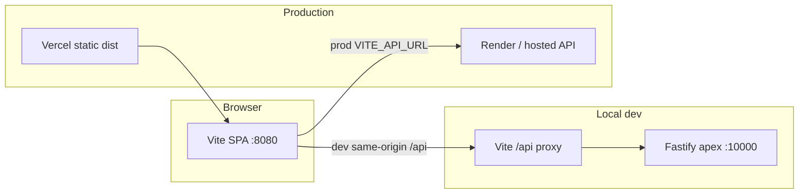

# Apex Frontend — Agent Guide

Apex is a **sim racing web app** (sessions, leaderboards, challenges, community, admin). This package is a **Vite + React SPA** that talks to the **Fastify API** in the sibling `apex` backend repo—not an embedded Express server.

## Tech stack

| Layer              | Choice                                                     |
| ------------------ | ---------------------------------------------------------- |
| Runtime            | React 18, TypeScript                                       |
| Routing            | React Router 7 (SPA, `BrowserRouter`)                      |
| Build              | Vite 7                                                     |
| Styling            | Tailwind CSS 3; `src/global.css` (shadcn/Admin) + `src/styles/theme.css` (product `.apex-theme` / `--apex-*`) |
| UI primitives      | Product: `src/components/app-ui/`; Admin/shadcn: `src/components/ui/` |
| Data fetching      | TanStack Query v5                                          |
| Forms / validation | react-hook-form + Zod 4                                    |
| Icons              | lucide-react                                               |
| Toasts             | sonner                                                     |
| Tests              | Vitest (`src/**/*.test.ts`, `src/**/*.spec.ts`)            |
| Package manager    | **pnpm** (see `packageManager` in `package.json`)          |

## Repository layout

```
apex-frontend/
├── index.html              # Vite entry; script → /src/main.tsx
├── vite.config.ts          # Dev server :8080, /api proxy, @ → src
├── vercel.json             # SPA rewrites + no-store on index
├── tailwind.config.ts      # shadcn tokens + product `apex.*` colors/fonts/radius
├── tsconfig.json           # paths: "@/*" → "./src/*"
├── vitest.config.ts
├── public/                 # Static assets (logo, sitemap, sim SVGs)
├── src/
│   ├── main.tsx            # Mount + global.css
│   ├── App.tsx             # Routes, providers, AppLayout / Admin shells
│   ├── global.css          # shadcn/Admin tokens (--background, --primary, …)
│   ├── styles/theme.css    # Product theme (.apex-theme, --apex-*, imported by AppLayout)
│   ├── pages/              # Product screens + pages/admin/
│   ├── components/         # AppLayout, HubTopBar, BottomNav, app-ui/, ui/, …
│   ├── features/           # Cross-page feature modules (settings, session-detail, …)
│   ├── lib/                # Utilities, API client, validation, grouping logic
│   ├── auth/               # Route guards (ProtectedRoute, AdminRoute, GuestOnlyRoute)
│   ├── contexts/           # AuthContext (GET /api/auth/me)
│   └── config/             # navigation.ts — nav/footer link source of truth
└── .builder/rules/         # Cursor/Builder agent rules (*.mdc)
```

There is **no** `client/`, `server/`, `shared/`, `pages/v2/`, or `components/v2/` folder. Product URLs are unprefixed only (no `/v2/*` redirect shim).

## Architecture



- **All business logic and persistence** live in the **apex backend** (`/api/*`).
- The frontend only renders UI, calls APIs, and stores the JWT in `localStorage` (`apex_token`).
- **Do not** add Express routes or a local BFF in this repo unless the product explicitly requires it.

### API client (`src/lib/api/`)

- **`config.ts`** — `API_BASE` from `VITE_API_URL` / `VITE_APEX_API_BASE_URL`, or defaults (`http://127.0.0.1:10000` dev, Render URL in prod builds).
- **`fetchClient.ts`** — `fetchApi()`, auth headers (`apex_token`, device id, server session cookie key), 401 → `registerAuthExpiredHandler`, `PRO_REQUIRED` event.
- **Domain modules** — `profile.ts`, `community.ts`, `challenges.ts`, `manualAndUpload.ts`, `admin*.ts`, etc.; re-exported from `index.ts`.
- Import from pages/components: `import { authMe, fetchApi } from "@/lib/api"`.

### Auth

- **`AuthProvider`** (`src/contexts/AuthContext.tsx`) — `useQuery` on `GET /api/auth/me` when `apex_token` exists; listens for `apex:auth` custom events (login/logout/impersonation).
- **Guards** — `ProtectedRoute`, `GuestOnlyRoute`, `AdminRoute` under `src/auth/`.
- **Impersonation** — admin flows; `ImpersonationExitFab`, `lib/impersonation.ts`.

### Routing (`src/App.tsx`)

- **Product shell** — `AppLayout` (`.apex-theme`) with per-route top bars (`HubTopBar` wrappers) and `BottomNav` where applicable.
- **Home** — `HomeRoute`: logged-in → `Dashboard`; logged-out → `PublicHome`.
- **Paths** — unprefixed production URLs (`/sessions/:id`, `/upload`, `/login`, …). Do not add `/v2` routes or legacy path aliases.
- **Canonical session URL** — `/sessions/:id` (and `/sessions/:id/edit` for edits).
- **Admin** — sibling tree under `/admin/*` with `AdminLayout` + `AdminRoute` (no product `AppLayout` / `apex-*` theme).
- New product routes go in the `AppShell` catch-all tree **above** the `*` NotFound route.

### UI organization

- **`pages/`** — one primary component per route; extract subcomponents into co-located folders (`pages/session/`, `pages/challenges/`, …) or `components/` / `features/`.
- **`features/`** — settings forms, session-detail insights, manual-activity hooks (co-located logic).
- **`components/app-ui/`** — product design-system primitives (AppDialog, AppSwitch, button class helpers).
- **`components/ui/`** — shadcn primitives used heavily by Admin; do not merge product tokens into these.
- **`config/navigation.ts`** — update when adding header/footer/account links.

### Activity feed / dashboard

- **`lib/sessionTypes.ts`** — shared `SessionItem` type for feed cards.
- **`lib/weekendDisplaySegments.ts`** — weekend carousel/single segmentation for feed rows.
- Dashboard feed UI lives under `components/dashboard/` (e.g. `ActivityFeedList`, activity cards) and `pages/Dashboard.tsx`.

## Commands

```bash
pnpm dev          # Vite on http://localhost:8080; proxies /api → VITE_DEV_API_PROXY_TARGET (default :10000)
pnpm build        # Output: dist/
pnpm preview      # Preview production build
pnpm typecheck    # tsc --noEmit
pnpm test         # vitest --run
pnpm lint         # eslint
pnpm format.fix   # prettier --write .
```

## Environment variables

Copy `.env.example` → `.env`. Only **`VITE_*`** variables are read by this app (Vite embeds them at build time).

| Variable                    | Required         | Description                                                                    |
| --------------------------- | ---------------- | ------------------------------------------------------------------------------ |
| `VITE_API_URL`              | Prod recommended | Fastify API base URL, no trailing slash (e.g. `https://apex-1-y319.onrender.com`) |
| `VITE_APEX_API_BASE_URL`    | No               | Alias for API base (legacy name)                                               |
| `VITE_DEV_API_PROXY_TARGET` | No               | Dev proxy target for `/api` (default `http://127.0.0.1:10000`)                 |
| `VITE_SUPPORT_EMAIL`        | No               | Footer mailto (default `support@apexsimtracker.com`)                           |
| `VITE_PUBLIC_BUILDER_KEY`   | No               | Builder.io CMS key if used                                                     |

**Local dev:** run the **apex backend** on port 10000 (or set `VITE_API_URL` / proxy target). Pointing `VITE_API_URL` at the Vercel SPA host will break API calls.

## Deployment (Vercel)

- **Build:** `pnpm build`
- **Output directory:** `dist`
- **Root directory:** `apex-frontend` (if deploying from monorepo)
- **`vercel.json`:** SPA fallback to `/index.html`; `Cache-Control: no-store` on `/` and `/index.html`
- Set **`VITE_API_URL`** in Vercel env for Production/Preview builds

Netlify is not configured in this repo; prefer Vercel for this SPA.

## Adding features

### New page

1. Add `src/pages/MyPage.tsx` (and optional `src/pages/<slug>/MyPageTopBar.tsx` wrapping `HubTopBar`).
2. Register the route inside the product `AppShell` tree in `src/App.tsx`, wrapped in `AppLayout` with `topBar` / `bottomBar` as needed (before `*`).
3. If nav-visible, add entry in `src/config/navigation.ts`.
4. Use `ProtectedRoute` / `GuestOnlyRoute` / `AdminRoute` when access control applies.

### New API call

1. Add typed functions in `src/lib/api/<domain>.ts` using `fetchApi` or `apiGet`/`apiPost` from `httpVerbs.ts`.
2. Export from `src/lib/api/index.ts` if part of the public API surface.
3. Use TanStack Query in the page (`useQuery` / `useMutation`) with stable `queryKey`s; invalidate related keys on success.

### New UI component

- Prefer small files under `src/components/` or `src/features/<name>/`.
- Product-styled primitives → `src/components/app-ui/`.
- Use `cn()` from `@/lib/utils` for class names.

### Styling

- Product UI runs under **`.apex-theme`** (via `AppLayout`): use Tailwind `apex-*` utilities (`bg-apex-background`, `text-apex-on-surface`, `font-apex-headline`, …) backed by `--apex-*` in `src/styles/theme.css`.
- Admin / shadcn use **`src/global.css`** tokens (`bg-background`, `text-primary`, …). Do not mix product `apex-*` classes into Admin.
- `<html>` also has `class="dark"` from `App.tsx` (affects shadcn tokens).
- Brand accent constant: `BRAND_RED` in `src/lib/appConfig.ts`.

### Android dev (Capacitor)

`pnpm dev:android` and `pnpm cap:run:android` use [`scripts/run-android.mjs`](scripts/run-android.mjs).

Optional env overrides:

```bash
export CAP_ANDROID_TARGET="Pixel_3a_API_34_extension_level_7_arm64-v8a"  # AVD id; omit to use default device
export JAVA_HOME="/path/to/jbr"  # optional; macOS defaults to Android Studio JBR when installed
```

## Testing

- Unit tests next to code (`*.test.ts`, `*.spec.ts`).
- `vitest.config.ts` mirrors Vite `@` alias.
- No component test harness yet; focus tests on pure lib logic (e.g. `weekendDisplaySegments`, `apexAnalysisDisplay`).

## Common pitfalls

- **Wrong API host** — must be Fastify backend, not the static frontend URL.
- **Duplicate React** — single `package.json` / one `node_modules`; do not reintroduce a nested `client/package.json`.
- **Session types** — API may send `MANUAL_ACTIVITY`; include in unions when typing feed items (`SessionItem` in `sessionTypes.ts`).
- **Asset URLs** — use `resolveApiUrl()` for `/api/assets/...` paths from the API.

## Related docs

- [`.builder/README.md`](.builder/README.md) — Builder/Cursor rule files
- [`public/README.md`](public/README.md) — static assets note
